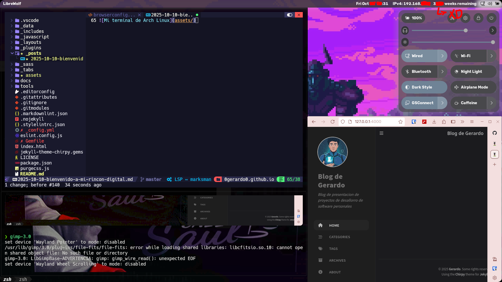

### **¡Hola y bienvenido!**
Has llegado a mi nuevo rincon en internet. Este blog nace de mi pasion por la tecnologia y mi deseo de documentar y compartir el viaje de aprendizaje en el que me encuentro.

La idea es simple: usar este espacio como una bitacora publica para mis proyectos, experimentos y los conceptos que voy explorando. Si te interesa el **desarrollo de software**, la **administración de sistemas** o simplemente si te gusta "ensuciarte las manos" con la tecnologia, probablemente hay algo de valor aquí.

## ¿Qué Temas encontrarás?

Mi curiosidad es amplia, pero mis principales area de enfoque seran:

* **Desarrollo a bajo Nivel:** Exploraciones y proyectos en `C` y, eventualmente incursionare con otros lenguajes de alto rendimiento, `Rust`.

* **Automatización y Herramienta:** Scripts y aplicaciones en `Python` para hacer la vida mas facil. 

* **Infrestructura personal:** Mis aventuras configurando servidores, redes, u servicios auto-alojados.

* **El ecosistema Linux**: Todo lo relacionado con mi sistema operativo de cabecera, **Arch Linux**

> "Lo que tenemos que aprender a hacer, lo aprendemos haciendolo." - Aristoteles 

## Mi introduccion a entender el formato del blog

Este post tambien me sirve como prueba para mostrar (y recordarme a mi mismo) qué se puede hacer con Markdown en este blog.

### Listado y Texto
Herramienta de tipado, *cusiva*, **negritas**, ~~texto tachado~~ y, por supuesto, listas.
1. *"Gente con cojone :p"*
2. **"La vida e bellakeo"**
3. ~~"Abajo las gor..."~~

### Bloques de Código
Una de las parte que mas se veran en este blog seran partes tecnicas, mostrando codigo resaltando bloques especificos para explicar de manera mas clara.

```python 
# Hola mundo de toda la vida
def hola_mundo_laboral (limite=16):
  
  for i in range(1, limite):
    if i % 15 == 0:
      print("FizzBuzz")
    elif i % 3 == 0:
      print("Fizz")
    elif i % 5 == 0:
      print("Buzz")
    else:
      print(i)

  hola_mundo_laboral()
```

### Imagenes

Para incluir imagenes es de la siguiente manera. Necesito incluir una imagen en `/assets/img/posts/` y referenciar.

``




###
El formato de tablas es muy util para comparar información.

| Caracteristicas | Lenguaje C | Python |
| ------------- | -------------- | -------------- |
| Velocidad | Muy alta | Moderada |
| Gestion de Memoria | Manual| Automatica |
| Curva de aprendizaje | Alta | Baja |

### Notificaciones Especiales

Este tema (Chirpy) tambien soporta  bloques de notificaciones para reslatar información importante.

> **Esto es una nota informatica.** Es util para da un consejo o información importante.
{: .prompt-info} 

> **Esto es una advertencia.** ideal para señalar posibles problemas o pasos que requieren cuidado especial.
{: .prompt-warning}

---
Espero que este espacio te sea tan util como espero que lo sea para mi. Sienentete libre de explorar y si algo te interesa mandame un correo o dm por mis redes sociales para poder, entablar una conversacion sobre el tema. 

Puedes encontrarme y ver mis proyectos en mi [Perfil de Github](https://github.com/0gerardo0)

## Referencia 

* **Cotes, C. (2024, 19 de julio)**. *Write a new post*. Chirpy. [https://chirpy.cotes.page/posts/write-a-new-post/](https://chirpy.cotes.page/posts/write-a-new-post/)

* **Cotes2020. (2024)**. *Jekyll-theme-chirpy* (Version 7.3.1) [Software]. GitHub. [https://github.com/cotes2020/jekyll-theme-chirpy](https://github.com/cotes2020/jekyll-theme-chirpy)
