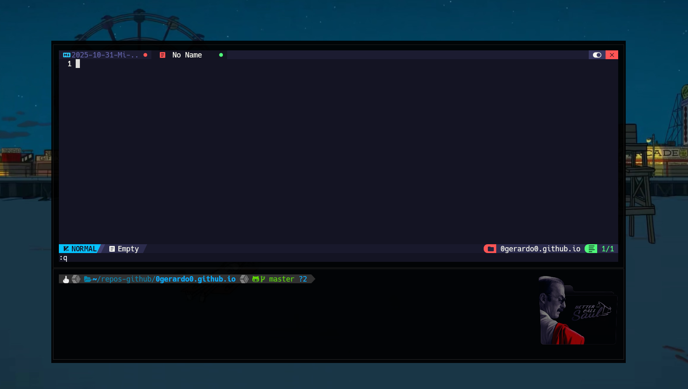
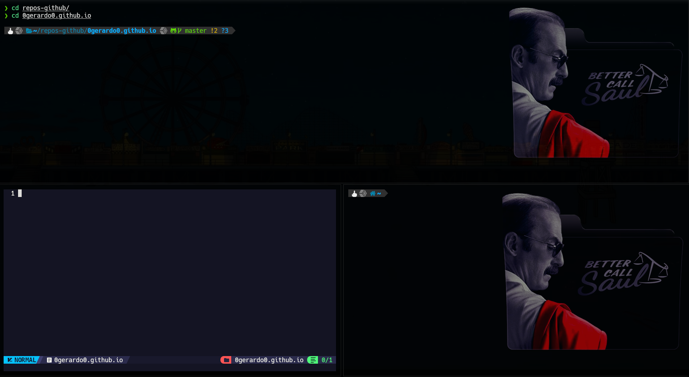

He decidido iniciar una serie de artículos para desglosar mi entorno de desarrollo. En lugar de hacer un post gigante con todas mis herramientas, creo que es más valioso dedicar un artículo a cada una, explicando por qué la elegí y cómo la he configurado para que se adapte a mi flujo de trabajo.

Empezamos por la pieza más fundamental para cualquier desarrollador de sistemas: **la terminal**.

Durante años, probé de todo: `gnome-terminal`, `alacritty` (tambien es una increible opción), `warp`, `Ghostty`. Todas son buenas, pero siempre sentía que faltaba algo. O eran lentas, o la gestión de ventanas era torpe, o la configuración era limitada. Entonces descubrí **Kitty** o bueno por sugerencia tambien cuando uno investiga sobre el profundo mundo de los entornos linux.


## ¿Por Qué Kitty?

Si tuviera que resumir mi elección en una palabra, sería: **minimalismo**.

Vivimos en una era de terminales que intentan ser IDEs. Vemos herramientas con asistentes de IA integrados, paletas de comandos, menús gráficos y todo tipo de botones que te lo dan todo "**en la boca** xd". Mi filosofía es la opuesta. Yo no quiero un entorno que tome decisiones por mí, quiero una herramienta que haga una cosa y la haga perfectamente: *emular una terminal*.

Kitty es exactamente eso. Es una ventana en blanco. No tiene barras de título, ni menús, ni botones preestablecidos. Es solo la terminal.

Pero este minimalismo es engañoso. Debajo de esa superficie simple, se esconde una potencia que las otras terminales "completas" tal vez puedan igualar, pero no en la forma que a mí me gusta:

1. **Rendimiento Bruto (Aceleración por GPU):** Es lo más rápido que he usado. Al renderizar todo con la GPU, la salida de texto es instantánea.

2. **Funcionalidad Integrada (No Plugins):** No necesito tmux para dividir ventanas, porque Kitty lo hace de forma nativa. Y lo más impresionante: puede mostrar imágenes directamente en la terminal o incluso una integración con la shell para cuando es conveniente trabajar con ssh. Esta es una capacidad integrada, no un hack.

3. **Control Manual Total:** Esta es la razón principal. Me gusta la sencillez de configurar manualmente lo que hace cada atajo de teclado. En lugar de un menú gráfico, tengo mi kitty.conf. Cada línea de ese archivo es una decisión que yo tomé, desde el grosor del cursor hasta cómo se mueven mis ventanas.

En resumen, elegí Kitty porque rechaza la tendencia de las herramientas sobrecargadas. Me da una base ligera y ultrarrápida, y luego me entrega el control total para construir exactamente el entorno que necesito, sin nada que no haya pedido explícitamente.

## Desglosando mi `kitty.conf`

La mejor forma de explicar por qué me gusta es mostrar mi configuración. No voy a pegar el archivo completo aquí, sino que lo dividiré en las secciones que considero más importantes.

> **Mi Configuración Completa:** Si prefieres ver todos los archivos, mi configuración actualizada de Kitty (incluyendo `kitty.conf` y el tema de color `color.ini`) está disponible en mi [repositorio de `dotfiles` en GitHub](https://github.com/0gerardo0/dotfiles/tree/main/dot_config/kitty).
{: .prompt-info }

A continuación, un desglose de las partes clave de mi `kitty.conf`:

### 1. La Estética: Fuentes, Transparencia y Bordes

Lo primero que notas de una terminal es cómo se ve. Mi objetivo era un look limpio, moderno y que se integrara con mi escritorio.

**Fuentes y Transparencia (El Fondo de Pantalla)**
Así es como consigo que mi fondo de pantalla se vea a través de la terminal, usando una fuente `NerdFont` que me permite tener iconos en `lsd` y `neovim`.

``` bash
  font_family HackNerdFont
  font_size 13
  disable_ligatures never

  # Esta es la clave para el fondo de pantalla
  background_opacity 0.92

  # Mi shell por defecto
  shell zsh
```

**Temas (Colores)** No me gusta tener mi esquema de colores dentro del archivo principal. Kitty te permite importar archivos, asi mantengo mis colores en un archivo separado.

```bash
  include color.ini
```
> **Nota 1:** Puedes encontrar cientos de temas para Kitty en repositorios de Github. Simplemente descargas un archivo `.ini` y lo incluyes de esta forma. Es increiblemente limpio.
{: .prompt-info}

> **Nota 2:** Otra utilidad e incluso mas importante que automatiza esta tarea es utilizar el comando `kitten theme` y todo esta directamente en la documetación de la terminal ['Changing kitty colors'](https://sw.kovidgoyal.net/kitty/kittens/themes/), y como menciona la misma documetación permite cambiar los colores de manera sencilla entre una colección de más de trecientos temas preestablecidos.
{: .prompt-info}

**Una Terminal "Sin Bordes" (Estilo Ricing)** Odio las barras de título y los bordes gruesos. Esta configuración crea una ventana minimalista, casi flotante.

```bash
  # Oculta la barra de título de la ventana
  hide_window_decoration yes

  # Define bordes y espacios mínimos
  window_border_width 1.0pt
  window_margin_width 1 2 1 2
  window_padding_width 10
  active_border_color none
  inactive_border_color #736D9F

  # Mi logo personal (se puede poner lo que quiera)
  window_logo_path ~/.config/kitty/logo-bcs-final.png
  window_logo_position right
  window_logo_alpha 0.5
```
Me agrada esta estetica y esto es lo que me gusta:



### 2. El flujo de Trabajo: Lo que es comodidad

Aquí es donde Kitty brilla. Uso su sistema de "layouts" para gestionar todas mis ventanas sin salir del teclado.

```bash
  # Mapeos para moverme entre ventanas divididas
  map ctrl+left neighboring_window left
  map ctrl+right neighboring_window right
  map ctrl+down neighboring_window down
  map ctrl+up neighboring_window up

  # Crear una nueva ventana en el mismo directorio
  map ctrl+shift+enter new_window_with_cwd

  # Cambiar entre layouts (ej. apilado, dividido, etc.)
  map ctrl+shift+z toggle_layout stack
```



### 3. Pequeños detalles, mejor calidad de vida

Finalmente, algunas pequeñas configuraciones que hacen que la experiencia sea mucho mejor. Facilidades o hacerlo tu mismo y entender que tu quieres ponerlo ahí.
```bash
    # No más "beep"
  enable_audio_bell no

  # Resaltado de URLs
  url_color #2fff39
  url_style curly
  detect_urls yes

  # Personalización del cursor
  cursor_shape beam
  cursor_beam_thickness 1.8
```

## Conclusión: Velocidad y Centralización

En conclusión, Kitty no es solo un reemplazo de terminal. Es el cimiento de un flujo de trabajo más rápido y enfocado. La fluidez de la GPU y su respuesta instantánea han hecho que gestionar archivos y editar código directamente en la terminal sea, para mí, mucho más eficiente que cualquier alternativa gráfica.

Ha sido el catalizador para desprenderme de IDEs pesados como VSCode y migrar por completo a herramientas nativas de la terminal, principalmente Neovim. Exploraremos esa herramienta en un post futuro, pero la filosofía es la clave.

Estoy en un proceso consciente de despegarme de las interfaces gráficas. Es un sacrificio deliberado: he cambiado los menús y los botones por la velocidad pura y la centralización de todas mis herramientas diarias en un solo lugar. Gracias a Kitty, mi terminal se ha convertido en mi único y verdadero entorno de desarrollo.

Para mí, es la herramienta perfecta que equilibra el rendimiento y la personalización.

## Referencias

* RootSpain. (2025). *Kitty - Emulador de terminal*. Recuperado de [https://blog.rootspain.com/linux/tools/kitty/](https://blog.rootspain.com/linux/tools/kitty/)

* HowToGeek. (2025). *GPU Acceleration in Linux Terminals: What It Is and Why It Matters*. Recuperado de [https://www.howtogeek.com/what-is-gpu-acceleration-in-linux-terminals/](https://www.howtogeek.com/what-is-gpu-acceleration-in-linux-terminals/)

* Goyal, K. (s.f.). *Kitty layouts documentation*. Recuperado de [https://sw.kovidgoyal.net/kitty/layouts/](https://sw.kovidgoyal.net/kitty/layouts/)

* Goyal, K. (s.f.). *kitty.conf documentation*. Recuperado de [https://sw.kovidgoyal.net/kitty/conf/](https://sw.kovidgoyal.net/kitty/conf/)

* Dexpota. (2018). *kitty-themes: A collection of themes for kitty terminal.* GitHub. Recuperado de [https://github.com/dexpota/kitty-themes](https://github.com/dexpota/kitty-themes)

* Kovid Goyal. (2025). *Nerd Fonts compatibility issue*. GitHub. Recuperado de [https://github.com/kovidgoyal/kitty/issues/8539](https://github.com/kovidgoyal/kitty/issues/8539)
