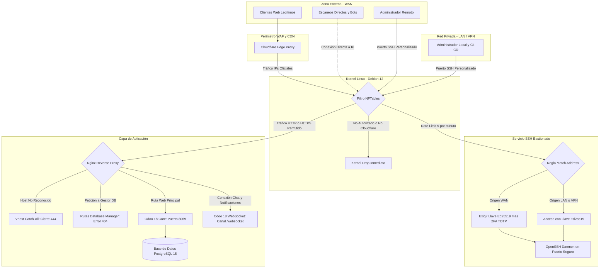
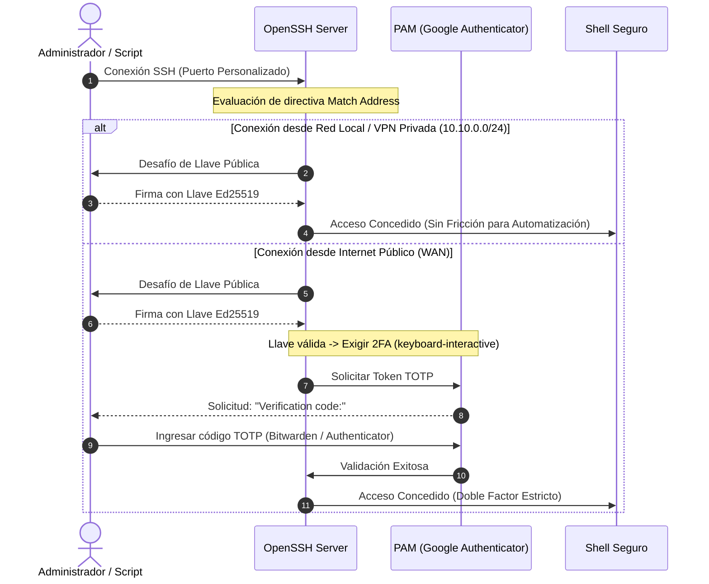

> *Resumen de auditoría de seguridad y bastionado del sistema mediante Lynis (índice 81/100), integrando perímetro NFTables con descarte en kernel, parámetros de kernel sysctl y autenticación 2FA condicional en OpenSSH.*
{: .prompt-info}

Desplegar un sistema ERP como Odoo 18 en un servidor expuesto a internet plantea una responsabilidad crítica de seguridad: la base de datos almacena el corazón operativo del negocio (contabilidad, nóminas, facturación electrónica y registros de clientes). Dejar el sistema operativo con los parámetros por defecto de una instalación estándar de Debian es una negligencia que invita a escaneos automatizados, ataques de fuerza bruta y explotación de servicios no aislados.

Sin embargo, el bastionado (*hardening*) de infraestructura en entornos de producción suele chocar contra la operatividad diaria. Si aplicas políticas de seguridad inflexibles —como exigir un código de segundo factor interactivo (2FA) en cada sesión SSH sin excepciones—, de inmediato rompes las tareas programadas de copias de seguridad remotas (`rclone`, `rsync`), los scripts de administración desatendidos y la observabilidad automatizada.

Para resolver este dilema bajo una postura de seguridad sólida y sin fricciones operativas, diseñé e implementé una arquitectura de seguridad por capas para Debian 12 Bookworm, logrando un **índice de hardening Lynis de 81 / 100** con más de 270 controles superados. En este artículo detallo el blueprint de esta implementación: el perímetro de red con **NFTables**, el blindaje a nivel de **Kernel Sysctl**, el esquema de **SSH con 2FA condicional**, y el aislamiento de aplicación en **Nginx**.



---

## 1. Perímetro de Red: NFTables con Filtrado Estricto de Cloudflare

En lugar de recurrir a capas de abstracción como UFW o la sintaxis obsoleta de `iptables`, implementé las reglas directamente en **NFTables**, el subsistema nativo de filtrado de paquetes del kernel Linux.

### El Problema del Escaneo Directo por IP

Cuando un servidor aloja servicios web protegidos por un CDN/WAF como Cloudflare, los atacantes intentan descubrir la dirección IP pública de origen para saltarse las reglas de mitigación DDoS y las políticas de bloqueo del proxy. Si el puerto 443 responde abiertamente a cualquier cliente de internet, un escáner como Shodan o Censys indexará los certificados TLS y expondrá el origen del servidor.

### Reglas de NFTables con Lista Blanca

Para neutralizar este vector, configuré NFTables con una política `drop` por defecto en la cadena de entrada (`hook input`). Los puertos 80 y 443 únicamente aceptan paquetes provenientes de los bloques CIDR oficiales de Cloudflare. Cualquier intento de conexión directa desde otra IP es descartado en silencio por el kernel, sin gastar ciclos de CPU en handshakes TLS ni registrar peticiones en los logs de Nginx:

```nft
#!/usr/sbin/nft -f

flush ruleset

table inet filter {
    # Conjuntos con los rangos IP oficiales de Cloudflare
    set cloudflare_ipv4 {
        type ipv4_addr
        flags interval
        elements = {
            173.245.48.0/20, 103.21.244.0/22, 103.22.200.0/22,
            103.31.4.0/22, 141.101.64.0/18, 108.162.192.0/18,
            190.93.240.0/20, 188.114.96.0/20, 197.234.240.0/22,
            198.41.128.0/17, 162.158.0.0/15, 104.16.0.0/13,
            104.24.0.0/14, 172.64.0.0/13, 131.0.72.0/22
        }
    }

    set cloudflare_ipv6 {
        type ipv6_addr
        flags interval
        elements = {
            2400:cb00::/32, 2606:4700::/32, 2803:f800::/32,
            2405:b500::/32, 2405:8100::/32, 2a06:98c0::/29,
            2c0f:f248::/32
        }
    }

    chain input {
        type filter hook input priority 0; policy drop;

        # Permitir tráfico local de loopback
        iif "lo" accept

        # Conexiones ya establecidas o relacionadas
        ct state established,related accept

        # Tráfico no válido descartado de inmediato
        ct state invalid drop

        # Permitir ICMP esencial (ping de diagnóstico y control MTU)
        ip protocol icmp icmp type { echo-request, destination-unreachable, time-exceeded } accept
        ip6 nexthdr icmpv6 icmpv6 type { echo-request, destination-unreachable, packet-too-big, time-exceeded } accept

        # HTTP/HTTPS: Exclusivamente desde Cloudflare
        ip saddr @cloudflare_ipv4 tcp dport { 80, 443 } accept
        ip6 saddr @cloudflare_ipv6 tcp dport { 80, 443 } accept

        # SSH en puerto personalizado (ej. 2222) con limitación de tasa (5 nuevas conexiones por minuto)
        tcp dport 2222 ct state new limit rate 5/minute accept

        # Descarte explícito con contador para auditoría
        counter drop
    }

    chain forward {
        type filter hook forward priority 0; policy drop;
    }

    chain output {
        type filter hook output priority 0; policy accept;
    }
}
```

Al activar estas reglas mediante `systemctl enable --now nftables`, cualquier escaneo SYN a los puertos web del servidor desde direcciones no autorizadas recibe un descarte instantáneo.

---

## 2. Hardening de SSH: Autenticación 2FA Condicional

El acceso administrativo al servidor requería máxima protección ante accesos desde WAN, pero con cero fricción para la automatización interna.



### El Dilema del 2FA en DevOps

Si configuras `libpam-google-authenticator` de manera global en PAM (`/etc/pam.d/sshd`), cualquier conexión SSH solicitará el código TOTP tras validar la llave criptográfica. Esto vuelve inviables las copias de seguridad periódicas mediante `rsync`, las sesiones de monitoreo sin interfaz humana o la orquestación remota.

### La Solución: Bloques Condicionales `Match Address`

OpenSSH permite aplicar directivas de autenticación diferenciadas según el origen de la conexión de red. Diseñé la siguiente estructura en `/etc/ssh/sshd_config`:

```text
# ==============================================================================
# BASTIONADO GENERAL DE OPENSSH
# ==============================================================================
Port 2222
Protocol 2
PermitRootLogin no
PasswordAuthentication no
PermitEmptyPasswords no
KbdInteractiveAuthentication yes
UsePAM yes
X11Forwarding no
AllowTcpForwarding no
AllowAgentForwarding no
MaxAuthTries 3
MaxSessions 2
ClientAliveInterval 300
ClientAliveCountMax 2

# ==============================================================================
# POLÍTICA DE AUTENTICACIÓN POR DEFECTO (WAN): LLAVE + 2FA TOTP OBLIGATORIO
# ==============================================================================
AuthenticationMethods publickey,keyboard-interactive

# ==============================================================================
# EXCEPCIÓN PARA RED LOCAL Y AUTOMATIZACIÓN (LAN/VPN): SOLO LLAVE
# ==============================================================================
Match Address 10.10.0.*,192.168.10.*
    AuthenticationMethods publickey
```

En la configuración de PAM (`/etc/pam.d/sshd`):

```text
# Desactivar inclusión de autenticación por contraseña estándar
# @include common-auth

# Exigir módulo TOTP de Google Authenticator
auth required pam_google_authenticator.so nullok
```

> La directiva `nullok` permite un despliegue gradual: si un usuario aún no ha ejecutado `google-authenticator` para enlazar su cuenta con Bitwarden o su app de autenticación, puede autenticarse temporalmente sólo con su llave pública. Una vez enrolado, el segundo factor es estricto.
{: .prompt-tip}

### El Detalle Crítico de Debian 12: `ssh.socket`

Un comportamiento específico de Debian 12 Bookworm es la adopción de la activación por socket de `systemd` para OpenSSH. Si cambias el puerto a `2222` en `sshd_config` y reinicias `ssh.service`, el demonio puede seguir escuchando en el puerto 22 predeterminado debido a `ssh.socket`.

Para tomar el control determinista del servicio, es indispensable enmascarar el socket:

```bash
sudo systemctl stop ssh.socket
sudo systemctl disable ssh.socket
sudo systemctl mask ssh.socket
sudo systemctl restart ssh.service
```

Con esto, el servicio `ssh.service` gobierna exclusivamente el proceso en el puerto asignado.

---

## 3. Hardening de Kernel y Memoria con Sysctl

Para prevenir ataques de red a nivel de pila IP y mitigar la recolección de información sobre la memoria del kernel por procesos locales comprometidos, configuré un archivo de políticas estricto en `/etc/sysctl.d/99-security.conf`:

```ini
# ==============================================================================
# PROTECCIÓN DE PILA DE RED Y ENRUTAMIENTO (IPV4 / IPV6)
# ==============================================================================

# Reverse Path Filtering estricto: descarta paquetes cuya ruta de retorno
# no coincida con la interfaz por la que entraron (inmunidad a IP Spoofing).
net.ipv4.conf.all.rp_filter = 1
net.ipv4.conf.default.rp_filter = 1

# Desactivar enrutamiento de paquetes con origen definido (Source Routing)
net.ipv4.conf.all.accept_source_route = 0
net.ipv4.conf.default.accept_source_route = 0
net.ipv6.conf.all.accept_source_route = 0
net.ipv6.conf.default.accept_source_route = 0

# Ignorar paquetes de redirección ICMP (prevención de ataques Man-in-the-Middle)
net.ipv4.conf.all.accept_redirects = 0
net.ipv4.conf.default.accept_redirects = 0
net.ipv6.conf.all.accept_redirects = 0
net.ipv6.conf.default.accept_redirects = 0
net.ipv4.conf.all.send_redirects = 0
net.ipv4.conf.default.send_redirects = 0

# Mitigación de ataques de amplificación Smurf (ignorar ICMP broadcast)
net.ipv4.icmp_echo_ignore_broadcasts = 1
net.ipv4.icmp_ignore_bogus_error_responses = 1

# Activación de TCP SYN Cookies ante saturación de cola de conexiones
net.ipv4.tcp_syncookies = 1

# Registro de paquetes marcados como marcianos (direcciones imposibles)
net.ipv4.conf.all.log_martians = 1
net.ipv4.conf.default.log_martians = 1

# ==============================================================================
# RESTRICCIÓN DE MEMORIA Y SEGURIDAD DEL KERNEL
# ==============================================================================

# Ocultar direcciones de punteros de memoria del kernel a usuarios sin privilegios
kernel.kptr_restrict = 2

# Restringir acceso al búfer dmesg únicamente al usuario root
kernel.dmesg_restrict = 1

# Desactivar combinaciones de teclas mágicas SysRq (excepto sync en emergencias)
kernel.sysrq = 16

# Bloquear volcados de memoria (core dumps) de binarios con privilegios SUID
fs.suid_dumpable = 0

# Restringir el alcance de ptrace a procesos hijos directos (mitiga inyecciones)
kernel.yama.ptrace_scope = 1
```

Para aplicar los cambios sin reiniciar:

```bash
sudo sysctl --system
```

### Bloqueo de Módulos de Red Obsoletos

El kernel Linux incluye soporte compilado para protocolos de transporte de nicho o heredados que presentan un historial frecuente de vulnerabilidades de desbordamiento. Bloqueé su carga automática en `/etc/modprobe.d/99-security-blacklist.conf`:

```text
install dccp /bin/true
install sctp /bin/true
install rds /bin/true
install tipc /bin/true
install firewire-core /bin/true
```

---

## 4. Capa de Aplicación: Nginx, Cabeceras y Aislamiento de Odoo 18

En la capa de aplicación, el proxy inverso Nginx actúa como escudo y enrutador. Odoo 18 introdujo una simplificación sustancial: la unificación del puerto web tradicional (`8069`) y el canal de Longpolling/WebSocket en un único endpoint nativo (`/websocket`), eliminando la necesidad del antiguo puerto `8072` separado.

### 1. Bloque Vhost Catch-All (Cierre Inmediato 444)

Cualquier cliente que intente conectar indicando una cabecera `Host` no registrada o solicitando acceso directo por IP es terminado inmediatamente:

```nginx
# /etc/nginx/conf.d/00-default-catchall.conf
server {
    listen 80 default_server;
    listen [::]:80 default_server;
    listen 443 ssl default_server;
    listen [::]:443 ssl default_server;

    ssl_certificate /etc/ssl/certs/ssl-cert-snakeoil.pem;
    ssl_certificate_key /etc/ssl/private/ssl-cert-snakeoil.key;

    server_name _;
    return 444; # Conexión cerrada sin respuesta
}
```

### 2. Bloqueo de la Interfaz de Gestión de Bases de Datos

Uno de los vectores más comunes de reconocimiento contra Odoo es el gestor web de bases de datos (`/web/database/manager` y `/web/database/selector`). Un atacante que descubra este endpoint puede intentar ataques de fuerza bruta contra la contraseña maestra del ERP.

En Nginx, bloqueé estos endpoints devolviendo `404 Not Found`, ocultando por completo su existencia hacia el exterior:

```nginx
# Ocultar gestor de base de datos hacia el exterior
location ~* ^/web/database/(manager|selector) {
    return 404;
}
```

### 3. Configuración del Proxy Reverso para Odoo 18 y WebSocket

La configuración del vhost de producción incorpora cabeceras estrictas de navegación, proxy buffering y el túnel WebSocket:

```nginx
upstream odoo_server {
    server 127.0.0.1:8069;
}

server {
    listen 443 ssl http2;
    server_name erp.example.com;

    # Certificados SSL de origen (Cloudflare Origin CA)
    ssl_certificate /etc/ssl/cloudflare/origin.pem;
    ssl_certificate_key /etc/ssl/cloudflare/origin.key;
    ssl_protocols TLSv1.2 TLSv1.3;
    ssl_ciphers HIGH:!aNULL:!MD5;

    # Cabeceras de seguridad estrictas
    add_header Strict-Transport-Security "max-age=31536000; includeSubDomains" always;
    add_header X-Frame-Options "SAMEORIGIN" always;
    add_header X-Content-Type-Options "nosniff" always;
    add_header X-XSS-Protection "1; mode=block" always;
    add_header Referrer-Policy "strict-origin-when-cross-origin" always;
    add_header Permissions-Policy "geolocation=(), microphone=(), camera=()" always;

    proxy_read_timeout 720s;
    proxy_connect_timeout 720s;
    proxy_send_timeout 720s;
    proxy_set_header X-Forwarded-Host $host;
    proxy_set_header X-Forwarded-For $proxy_add_x_forwarded_for;
    proxy_set_header X-Forwarded-Proto $scheme;
    proxy_set_header X-Real-IP $remote_addr;

    # Canal nativo WebSocket de Odoo 18
    location /websocket {
        proxy_pass http://odoo_server;
        proxy_set_header Upgrade $http_upgrade;
        proxy_set_header Connection "upgrade";
        proxy_set_header X-Forwarded-Host $host;
        proxy_set_header X-Forwarded-For $proxy_add_x_forwarded_for;
        proxy_set_header X-Forwarded-Proto $scheme;
        proxy_set_header X-Real-IP $remote_addr;
    }

    location / {
        proxy_pass http://odoo_server;
        proxy_redirect off;
    }

    # Bloqueo de endpoints sensibles
    location ~* ^/web/database/(manager|selector) {
        return 404;
    }
}
```

---

## 5. Monitoreo de Integridad y Resultados de Auditoría Lynis

La seguridad no es un estado estático, sino un proceso de verificación continua. Para garantizar que los binarios del sistema no hayan sido alterados y que las configuraciones se mantengan íntegras, implementé dos herramientas automatizadas con temporizadores de `systemd`:

1. **AIDE (Advanced Intrusion Detection Environment):** Generé una base criptográfica de 196 MB en `/var/lib/aide/aide.db.gz` que almacena firmas SHA-256 y metadatos de permisos de todos los archivos sensibles en `/etc`, `/usr/bin`, `/usr/sbin` y `/var`. Un temporizador diario (`dailyaidecheck.timer`) compara el árbol del disco contra la base de referencia.
2. **Lynis Security Audit:** Auditoría automatizada que evalúa más de 270 pruebas de configuración CIS y mejores prácticas del sistema operativo.

### Resultado de la Auditoría Lynis

Tras aplicar todas las capas anteriores, el informe de Lynis arrojó las siguientes métricas:

| Métrica Auditada | Valor Obtenido | Estado |
| :--- | :---: | :---: |
| **Hardening Index (Índice Lynis)** | **81 / 100** | Excelente (Nivel Enterprise) |
| **Pruebas y Controles Evaluados** | **276** | Verificados |
| **Autenticación Root** | **Bloqueada** (`passwd -l`) | Cumplido |
| **PAM Password Quality** | **Mínimo 12 chars + símbolos** | Activo (`libpam-pwquality`) |
| **Aislamiento de Sesiones `/tmp`** | **Privado por UID** | Activo (`libpam-tmpdir`) |
| **Umask del Sistema** | **027** (`/etc/login.defs`) | Archivos nuevos sin lectura pública |
| **File Integrity Monitoring (FIM)** | **AIDE Activo** | Base generada y timer habilitado |

---

## Conclusiones

El despliegue de infraestructura crítica para producción requiere alejarse tanto de las configuraciones por defecto como del bastionado ciego que rompe la operación. La clave reside en aplicar el principio de defensa en profundidad:

1. **Descarte perimetral temprano:** Con NFTables filtrando las IPs del proxy CDN a nivel de kernel, los puertos web quedan invisibles a los escáneres de internet sin consumir recursos del servidor.
2. **Seguridad condicional basada en contexto:** El uso de directivas `Match Address` en OpenSSH demuestra que es posible combinar un segundo factor TOTP infranqueable desde redes públicas con la agilidad que demandan las tareas de automatización interna y respaldo.
3. **Aislamiento en capas:** Desde los límites de memoria en sysctl hasta las cabeceras defensivas y el bloqueo de rutas en Nginx, cada barrera mitiga una clase distinta de vectores de ataque.

El blueprint y las plantillas de configuración están disponibles en mi repositorio [0gerardo0/odoo-server-playbook](https://github.com/0gerardo0/odoo-server-playbook).

---

## Referencias

* **Center for Internet Security (CIS).** *CIS Debian Linux 12 Benchmark v1.0.0.* CIS Security Benchmarks. [https://www.cisecurity.org/benchmark/debian_linux](https://www.cisecurity.org/benchmark/debian_linux)
* **Debian Project.** *Debian Security Manual: Hardening and Securing your Debian System.* Debian Documentation. [https://www.debian.org/doc/manuals/securing-debian-manual/](https://www.debian.org/doc/manuals/securing-debian-manual/)
* **Netfilter Core Team.** *nftables HOWTO Documentation.* Netfilter Project. [https://wiki.nftables.org/wiki-nftables/index.php/Main_Page](https://wiki.nftables.org/wiki-nftables/index.php/Main_Page)
* **OpenSSH Project.** *sshd_config(5) — OpenSSH daemon configuration file.* OpenBSD Manual Pages. [https://man.openbsd.org/sshd_config.5](https://man.openbsd.org/sshd_config.5)
* **Odoo S.A.** *Odoo 18.0 Deployment, Proxy and Security Guidelines.* Odoo Official Documentation. [https://www.odoo.com/documentation/18.0/administration/on_premise/deploy.html](https://www.odoo.com/documentation/18.0/administration/on_premise/deploy.html)
* **CISOfy.** *Lynis: Security auditing tool for Linux, macOS, and UNIX-based systems.* [https://cisofy.com/lynis/](https://cisofy.com/lynis/)
