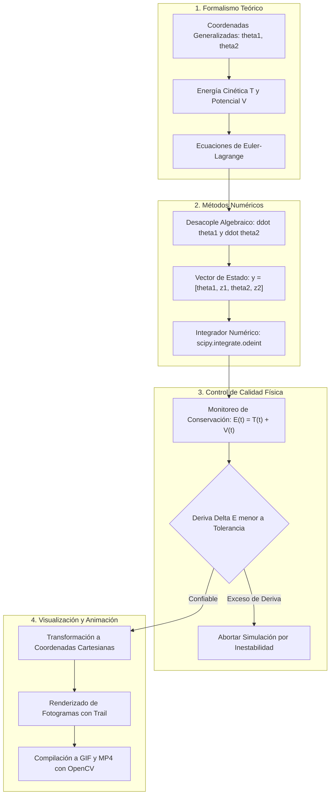

> *Retrospectiva de un proyecto desarrollado durante mi formación universitaria para la materia de Física de Ondas y Mecánica de Fenómenos Ondulatorios. El código fuente original, scripts de renderizado y notas teóricas se encuentran preservados en mi repositorio [`0gerardo0/Simulacion-de-un-pendulo-doble`](https://github.com/0gerardo0/Simulacion-de-un-pendulo-doble).*
{: .prompt-info}

Durante mi etapa universitaria, en la asignatura enfocada en **Física de Ondas y Mecánica de Fenómenos Ondulatorios**, el profesor planteó una entrega práctica que nos exigía ir más allá de la resolución analítica tradicional en el pizarrón: debíamos modelar computacionalmente un sistema oscilatorio acoplado y generar una simulación visual fidedigna de su comportamiento físico.

El planteamiento ofrecía dos vertientes conceptualmente hermanadas:
1. Modelar las oscilaciones transversales de una **cuerda elástica cargada con partículas discretas y nodos fijos** (un clásico problema de modos normales de oscilación y relaciones de dispersión).
2. Modelar el movimiento de un **péndulo doble plano bajo gravedad uniforme**, un sistema dinámico que, a pesar de contar con únicamente dos grados de libertad, exhibe una transición abrupta hacia el caos determinista y una hipersensibilidad extrema a las condiciones iniciales.

{: .w-75 .shadow .rounded }
*Mis notas manuscritas originales explorando la formulación analítica de la cuerda con masas acopladas antes de decantarme por la simulación del péndulo doble.*

Aunque resolví la formulación analítica de la cuerda cargada en mis apuntes teóricos, me decanté por construir la simulación completa del **péndulo doble**. La promesa de observar trayectorias caóticas y no periódicas representaba un desafío de ingeniería mucho más estimulante. 

Sin embargo, pronto descubrí que existía un abismo entre derivar las ecuaciones de Euler-Lagrange en hojas de papel y lograr que un script en la computadora resolviera numéricamente las trayectorias sin violar las leyes de conservación de la física.



---

## El Dilema de Herramientas: ¿Por qué Python?

Al momento de definir el stack técnico para la tarea, evalué varias alternativas habituales en los laboratorios universitarios:

* **MATLAB / GNU Octave:** Eran las herramientas estándar promovidas en la facultad para álgebra lineal y simulación de señales. De hecho, conservo borradores iniciales de exploración como [`ondas.m`](https://github.com/0gerardo0/Simulacion-de-un-pendulo-doble/blob/main/ondas.m). No obstante, la generación de animaciones cuadro por cuadro y el control fino de renderizado en Octave resultaban rígidos y lentos.
* **Wolfram Mathematica:** Insuperable en cálculo simbólico y derivación analítica de matrices hessianas o lagrangianos gigantescos, pero restrictivo en cuanto a portabilidad, licencias y pipelines de exportación multimedia desatendidos.
* **R:** Excelente en estadística y análisis exploratorio de datos, pero poco natural para integrar sistemas dinámicos continuos y generar secuencias gráficas de alta frecuencia temporal.

**Python** se impuso con contundencia. El ecosistema científico conformado por `numpy` para cálculo vectorial, `scipy.integrate` para algoritmos de resolución de ecuaciones diferenciales ordinarias (ODEs) y `matplotlib` junto con `opencv-python` e `imageio` para procesar y compilar video, ofrecía una flexibilidad inigualable sin depender de licencias privativas.

---

## Formulación Mecánica: Del Lagrangiano al Espacio de Estados

Intentar modelar el péndulo doble mediante la mecánica newtoniana tradicional ($\sum \mathbf{F} = m\mathbf{a}$) es una receta para el dolor de cabeza: las fuerzas de tensión en las dos barras rígidas cambian continuamente de dirección y magnitud, introduciendo fuerzas de ligadura internas que complican el sistema algebraico de vectores.

El camino riguroso y elegante es el **formalismo lagrangiano**, que opera enteramente con magnitudes escalares de energía sobre coordenadas generalizadas.

### 1. Coordenadas Generalizadas y Geometría

Definí el sistema con dos barras rígidas sin masa de longitudes $L_1$ y $L_2$, y dos masas puntuales $m_1$ y $m_2$ ubicadas en sus extremos. Tomando como coordenadas generalizadas los ángulos $\theta_1$ y $\theta_2$ medidos respecto a la vertical descendente:

$$\begin{aligned}
x_1 &= L_1 \sin\theta_1, & y_1 &= -L_1 \cos\theta_1 \\
x_2 &= x_1 + L_2 \sin\theta_2, & y_2 &= y_1 - L_2 \cos\theta_2
\end{aligned}$$

Derivando respecto al tiempo $t$, obtuve los componentes de velocidad cartesiana:

$$\begin{aligned}
\dot{x}_1 &= L_1 \dot{\theta}_1 \cos\theta_1, & \dot{y}_1 &= L_1 \dot{\theta}_1 \sin\theta_1 \\
\dot{x}_2 &= \dot{x}_1 + L_2 \dot{\theta}_2 \cos\theta_2, & \dot{y}_2 &= \dot{y}_1 + L_2 \dot{\theta}_2 \sin\theta_2
\end{aligned}$$

### 2. Balances de Energía y Función Lagrangiana

La **energía cinética total** ($T$) es la suma de las contribuciones de ambas masas:

$$T = \frac{1}{2} m_1 (\dot{x}_1^2 + \dot{y}_1^2) + \frac{1}{2} m_2 (\dot{x}_2^2 + \dot{y}_2^2)$$

Sustituyendo las velocidades cartesianas y aplicando identidades trigonométricas ($\cos^2\theta + \sin^2\theta = 1$ y $\cos(\theta_1 - \theta_2) = \cos\theta_1\cos\theta_2 + \sin\theta_1\sin\theta_2$):

$$T = \frac{1}{2} m_1 L_1^2 \dot{\theta}_1^2 + \frac{1}{2} m_2 \left[ L_1^2 \dot{\theta}_1^2 + L_2^2 \dot{\theta}_2^2 + 2 L_1 L_2 \dot{\theta}_1 \dot{\theta}_2 \cos(\theta_1 - \theta_2) \right]$$

La **energía potencial gravitatoria** ($V$), tomando el origen en el punto de anclaje superior ($y=0$):

$$V = m_1 g y_1 + m_2 g y_2 = -(m_1 + m_2) g L_1 \cos\theta_1 - m_2 g L_2 \cos\theta_2$$

El Lagrangiano del sistema queda definido por $\mathcal{L} = T - V$:

$$\mathcal{L} = \frac{1}{2}(m_1 + m_2)L_1^2\dot{\theta}_1^2 + \frac{1}{2}m_2 L_2^2\dot{\theta}_2^2 + m_2 L_1 L_2 \dot{\theta}_1 \dot{\theta}_2 \cos(\theta_1 - \theta_2) + (m_1 + m_2)g L_1 \cos\theta_1 + m_2 g L_2 \cos\theta_2$$

### 3. Ecuaciones del Movimiento (Euler-Lagrange)

Aplicando las ecuaciones de Euler-Lagrange para cada coordenada generalizada $q_i \in \{\theta_1, \theta_2\}$:

$$\frac{d}{dt}\left( \frac{\partial \mathcal{L}}{\partial \dot{q}_i} \right) - \frac{\partial \mathcal{L}}{\partial q_i} = 0$$

Al calcular las derivadas parciales y temporales, surge un acoplamiento directo entre las aceleraciones angulares $\ddot{\theta}_1$ y $\ddot{\theta}_2$:

$$\begin{aligned}
(m_1 + m_2) L_1 \ddot{\theta}_1 + m_2 L_2 \ddot{\theta}_2 \cos(\theta_1 - \theta_2) + m_2 L_2 \dot{\theta}_2^2 \sin(\theta_1 - \theta_2) + (m_1 + m_2) g \sin\theta_1 &= 0 \\
m_2 L_2 \ddot{\theta}_2 + m_2 L_1 \ddot{\theta}_1 \cos(\theta_1 - \theta_2) - m_2 L_1 \dot{\theta}_1^2 \sin(\theta_1 - \theta_2) + m_2 g \sin\theta_2 &= 0
\end{aligned}$$

### 4. El Cuello de Botella: Despeje y Reducción al Espacio de Estados

Aquí radicó el reto más arduo del proyecto. Ningún integrador numérico estándar (como `scipy.integrate.odeint`) acepta ecuaciones implícitas acopladas de segundo orden. Los solvers esperan una función vectorial de primer orden:

$$\frac{d\mathbf{y}}{dt} = \mathbf{f}(\mathbf{y}, t)$$

Para lograrlo, tuve que resolver manualmente el sistema algebraico lineal de $2 \times 2$ para despejar explícitamente $\ddot{\theta}_1$ y $\ddot{\theta}_2$. 

Definiendo $\Delta\theta = \theta_1 - \theta_2$, el denominador común de acoplamiento resulta ser:

$$\mu(\Delta\theta) = m_1 + m_2 \sin^2(\Delta\theta)$$

Las aceleraciones angulares explícitas quedan formuladas como:

$$\ddot{\theta}_1 = \frac{m_2 g \sin\theta_2 \cos\Delta\theta - m_2 \sin\Delta\theta \left( L_1 \dot{\theta}_1^2 \cos\Delta\theta + L_2 \dot{\theta}_2^2 \right) - (m_1 + m_2) g \sin\theta_1}{L_1 \left( m_1 + m_2 \sin^2\Delta\theta \right)}$$

$$\ddot{\theta}_2 = \frac{(m_1 + m_2) \left[ L_1 \dot{\theta}_1^2 \sin\Delta\theta - g \sin\theta_2 + g \sin\theta_1 \cos\Delta\theta \right] + m_2 L_2 \dot{\theta}_2^2 \sin\Delta\theta \cos\Delta\theta}{L_2 \left( m_1 + m_2 \sin^2\Delta\theta \right)}$$

Con estas expresiones, transformé el sistema de segundo orden en un vector de estado de 4 dimensiones $\mathbf{y} = [\theta_1, z_1, \theta_2, z_2]^T$ donde $z_1 = \dot{\theta}_1$ y $z_2 = \dot{\theta}_2$:

$$\frac{d}{dt}\begin{bmatrix} \theta_1 \\ z_1 \\ \theta_2 \\ z_2 \end{bmatrix} = \begin{bmatrix} z_1 \\ \ddot{\theta}_1(\theta_1, z_1, \theta_2, z_2) \\ z_2 \\ \ddot{\theta}_2(\theta_1, z_1, \theta_2, z_2) \end{bmatrix}$$

---

## Implementación en Python: Código y Guardián de Energía

En el repositorio implementé esta lógica en el archivo [`mov_anim_modif.py`](https://github.com/0gerardo0/Simulacion-de-un-pendulo-doble/blob/main/mov_anim_modif.py). 

A continuación presento la función vectorial que traduce fielmente el sistema algebraico a NumPy:

```python
import numpy as np
from scipy.integrate import odeint

# Parámetros físicos del sistema
L1, L2 = 5.0, 2.5      # Longitudes de las barras (m)
m1, m2 = 1.0, 1.0      # Masas de los cuerpos (kg)
g = 9.81               # Aceleración de la gravedad (m/s^2)

def ecua_mov(y, t, L1, L2, m1, m2):
    """
    Evalúa el campo vectorial dy/dt para el péndulo doble.
    y = [theta1, theta1_punto, theta2, theta2_punto]
    """
    theta1, z1, theta2, z2 = y
    delta = theta1 - theta2
    c, s = np.cos(delta), np.sin(delta)
    denominador = m1 + m2 * s**2

    # Derivadas de primer orden
    theta1_dot = z1
    theta2_dot = z2

    # Aceleraciones angulares desacopladas
    z1_dot = (
        m2 * g * np.sin(theta2) * c
        - m2 * s * (L1 * z1**2 * c + L2 * z2**2)
        - (m1 + m2) * g * np.sin(theta1)
    ) / (L1 * denominador)

    z2_dot = (
        (m1 + m2) * (L1 * z1**2 * s - g * np.sin(theta2) + g * np.sin(theta1) * c)
        + m2 * L2 * z2**2 * s * c
    ) / (L2 * denominador)

    return theta1_dot, z1_dot, theta2_dot, z2_dot
```

### El Guardián de la Simulación: Verificación de $\Delta E$

En un sistema físico conservativo (sin fricción viscosa ni disipación en las articulaciones), el Teorema de Noether garantiza que la energía mecánica total $E = T + V$ debe permanecer rigurosamente constante a lo largo del tiempo:

$$\frac{dE}{dt} = 0 \quad \Longrightarrow \quad E(t) = E(0), \quad \forall t \ge 0$$

Sin embargo, los integradores numéricos introducen errores de discretización y truncamiento en cada paso temporal $dt$. Si el paso de integración es demasiado grande o si el método no es adecuado, el sistema acumula energía de forma espuria, provocando que el péndulo "gane velocidad" de la nada.

Para garantizar la validez científica del modelo, incorporé una rutina de validación que calcula la deriva energética absoluta y detiene la ejecución si se excede el umbral tolerado:

```python
def energia_del_sistema(y):
    """Calcula la energía mecánica total E = T + V del sistema."""
    th1, z1, th2, z2 = y.T
    delta = th1 - th2

    # Energía potencial gravitatoria
    V = -(m1 + m2) * L1 * g * np.cos(th1) - m2 * L2 * g * np.cos(th2)

    # Energía cinética
    T = 0.5 * m1 * (L1 * z1)**2 + 0.5 * m2 * (
        (L1 * z1)**2 + (L2 * z2)**2 + 2 * L1 * L2 * z1 * z2 * np.cos(delta)
    )
    return T + V

# Condiciones iniciales: [theta1, omega1, theta2, omega2]
y0 = np.array([3 * np.pi / 4, 0.0, np.pi / 2, 0.0])
tmax, dt = 30.0, 0.01
t = np.arange(0, tmax + dt, dt)

# Integración numérica
y = odeint(ecua_mov, y0, t, args=(L1, L2, m1, m2))

# Verificación de deriva energética
energia_total = energia_del_sistema(y)
energia_inicial = energia_total[0]
deriva_maxima = np.max(np.abs(energia_total - energia_inicial))

error_tolerancia = 0.5  # Límite en Joules
if deriva_maxima > error_tolerancia:
    raise RuntimeError(f"Simulación inestable: deriva energética de {deriva_maxima:.4f} J excede la tolerancia.")
```

---

## Análisis Dinámico y Emergencia del Caos

Para comprobar el comportamiento del sistema bajo condiciones energéticas reales, ejecuté la simulación durante $t = 30\text{ s}$ con un paso $dt = 0.01\text{ s}$. 

A continuación presento la radiografía dinámica completa del modelo:

{: .shadow .rounded }
*(A) Trayectoria espacial de la segunda masa; (B) Retrato de fase $(\theta_2, \dot{\theta}_2)$; (C) Conservación estricta de energía mecánica y deriva numérica; (D) Divergencia exponencial ante una perturbación inicial de apenas $0.001\text{ rad}$.*

### 1. Órbita Espacial y Desvanecimiento Temporal (Panel A)
La trayectoria de la masa distal $m_2$ en el plano cartesiano evidencia la ausencia total de periodicidad. El brazo describe lazos, curvas de retorno y cambios bruscos de concavidad conforme la energía fluye alternativamente entre el primer y el segundo péndulo.

### 2. Espacio de Fase $(\theta_2, \dot{\theta}_2)$ (Panel B)
En sistemas oscilatorios lineales simples (como el péndulo simple con pequeñas oscilaciones), el espacio de fase es una elipse cerrada regular. En el péndulo doble, el espacio de fase revela trayectorias complejas que llenan regiones continuas sin cruzarse a sí mismas (en el espacio cuatridimensional completo), característica diagnóstica de los atractores en sistemas hamiltonianos no integrables.

### 3. Estabilidad Numérica (Panel C)
Mientras la energía cinética $T(t)$ y potencial $V(t)$ oscilan violentamente entre $-120\text{ J}$ y $190\text{ J}$, la energía total $E(t) = T + V$ se mantiene confinada en una línea horizontal plana en torno a $\approx 69.8\text{ J}$. En el eje derecho (escala logarítmica), observamos que la deriva numérica de `odeint` (LSODA) se mantiene por debajo de $10^{-5}\text{ J}$ durante los 30 segundos, validando que los fotogramas generados reflejan física real y no artefactos numéricos.

### 4. El Efecto Mariposa y el Horizonte de Lyapunov (Panel D)
Para poner a prueba el caos determinista, integré dos simulaciones paralelas con condiciones iniciales casi indistinguibles:

* Péndulo A: $\theta_1(0) = \frac{3\pi}{4}\text{ rad}$
* Péndulo B: $\theta_1(0) = \frac{3\pi}{4} + 0.001\text{ rad}$ (una discrepancia minúscula de apenas $0.057^\circ$).

Durante los primeros $5$ a $6$ segundos, la divergencia angular $|\Delta \theta_2(t)|$ permanece por debajo de $0.01\text{ rad}$; ambos péndulos parecen moverse al unísono. Sin embargo, al alcanzar el **Horizonte de Lyapunov** ($\approx 6.5\text{ s}$), la separación angular crece de manera exponencial hasta desacoplarse por completo: el péndulo B ejecuta bucles completos mientras el péndulo A invierte su giro. Este resultado ilustra por qué los sistemas caóticos son deterministas pero computacionalmente impredecibles a largo plazo.

---

## Pipeline de Animación: Del Fotograma al GIF

La visualización en movimiento es donde el modelo cobra vida. En el repositorio exploré dos vías: [`Pendulo_animado.py`](https://github.com/0gerardo0/Simulacion-de-un-pendulo-doble/blob/main/Pendulo_animado.py) utilizando `matplotlib.animation.FuncAnimation` en tiempo real, y [`mov_anim_modif.py`](https://github.com/0gerardo0/Simulacion-de-un-pendulo-doble/blob/main/mov_anim_modif.py) junto a [`makevideo.py`](https://github.com/0gerardo0/Simulacion-de-un-pendulo-doble/blob/main/makevideo.py) para renderizado desacoplado a disco.

{: .w-75 .shadow .rounded }
*Animación real generada por mi script en el repositorio: se aprecia el rastro de la trayectoria con decaimiento de opacidad (alpha trail).*

Para conseguir el efecto visual de "estela" o rastro de movimiento que se desvanece suavemente detrás de la masa $m_2$, implementé un algoritmo que segmenta los últimos $N$ pasos temporales y modula la transparencia $\alpha$ de manera cuadrática:

```python
# Segmentación de la estela en 20 sub-segmentos con transparencia cuadrática
ns = 20
s = max_trayectoria // ns

for j in range(ns):
    imin = i - (ns - j) * s
    if imin < 0:
        continue
    imax = imin + s + 1
    # Decaimiento alfa cuadrático para suavizar el rastro
    alpha = (j / ns)**2
    ax.plot(x2[imin:imax], y2[imin:imax], c='r', solid_capstyle='butt', lw=2, alpha=alpha)
```

Posteriormente, `makevideo.py` lee secuencialmente los fotogramas generados en el directorio local y los compila con OpenCV e `imageio`:

```python
import cv2
import imageio.v2 as imageio

# Compilación de fotogramas a GIF animado
salida_video_gif = 'movimiento_pendulo.gif'
with imageio.get_writer(salida_video_gif, mode='I', duration=1/fps) as writer:
    for archivo_imagen in archivos_imagenes:
        imagen = imageio.imread(archivo_imagen)
        writer.append_data(imagen)
```

---

## Autocrítica Técnica: Errores, Limitaciones y Qué Haría Diferente Hoy

Al analizar este proyecto con la perspectiva de los años y mayor madurez en ingeniería de software, reconozco varias deudas técnicas y oportunidades de optimización que pasé por alto siendo estudiante:

### 1. Ausencia de Integradores Simplécticos
Utilicé `odeint`, que implementa la familia LSODA (métodos Adams y BDF). Aunque es excelente para sistemas rígidos (*stiff equations*) y tolerancias estrictas a corto plazo, **no es un integrador simpléctico**.

Los solvers estándar de Runge-Kutta o multipaso no conservan la forma simpléctica del espacio de fase ni preservan invariantes hamiltonianos en integraciones temporales muy extensas ($t \to \infty$); inevitablemente introducen disipación artificial o acumulación secular de energía. Para una simulación física de grado de investigación, debí haber implementado un integrador simpléctico como **Verlet de velocidad**, **Leapfrog** o métodos simplécticos de orden superior (como el algoritmo de Yoshida).

### 2. Cuello de Botella Severo de I/O en Disco
El script de renderizado original guardaba miles de imágenes individuales en disco (`plt.savefig('trayectoria/img_frame{:04d}.png')`) para luego volver a abrirlas con OpenCV y ensamblar el GIF. 

Esta aproximación saturó las lecturas y escrituras de mi disco duro y demoró innecesariamente el cómputo. Hoy implementaría un flujo en memoria: renderizar los cuadros directamente a un búfer de bytes (`io.BytesIO`) o inyectar los frames mediante un canal de tubería estándar (*pipe stdin*) directamente al proceso de `ffmpeg`:

```bash
# Patrón óptimo en streaming: cero escrituras a disco
ffmpeg -f rawvideo -pixel_format rgb24 -video_size 800x800 -framerate 30 -i - -c:v libx264 out.mp4
```

### 3. Parámetros Quemados en Código (*Hardcoding*)
Las masas, longitudes, condiciones iniciales y tiempos estaban incrustados directamente como constantes en el cuerpo de los scripts. Cualquier experimento requería editar el archivo `.py` manualmente. Implementar una interfaz por línea de comandos con `argparse` o permitir la carga de configuraciones mediante archivos YAML habría transformado el script escolar en una herramienta reproducible y modular.

### 4. Cuantificación Formal del Caos
Como el entregable era una tarea escolar, me conformé con visualizar la gráfica espacial y verificar la conservación de energía. Sin embargo, no cuantifiqué formalmente el **máximo exponente de Lyapunov** ($\lambda$), el cual se obtiene linealizando la matriz variacional del flujo dinámico a lo largo de la trayectoria fiducial:

$$\lambda = \lim_{t \to \infty} \frac{1}{t} \ln \left( \frac{\|\delta \mathbf{y}(t)\|}{\|\delta \mathbf{y}(0)\|} \right)$$

Haber calculado $\lambda$ habría permitido demostrar matemáticamente el umbral en el que el sistema transiciona de cuasiperiódico a caótico según la energía total inyectada.

---

## Conclusiones

Lo que comenzó como una entrega académica para la materia de **Física de Ondas y Fenómenos Ondulatorios** se convirtió en una de mis experiencias de aprendizaje más valiosas durante la carrera de ingeniería. 

El proyecto me enseñó tres lecciones que aún aplico a diario en el desarrollo de software y la infraestructura:

1. **La teoría analítica requiere un puente computacional cuidadoso:** Poseer las ecuaciones de Euler-Lagrange en papel no sirve de nada si no sabes desacoplar algebraicamente las derivadas segundas ni formular un vector de estado de primer orden que un solver numérico pueda digerir.
2. **Los sistemas numéricos deben tener guardianes de invariantes:** En cualquier pipeline computacional —ya sea física, finanzas o criptografía—, debes programar aserciones que vigilen los invariantes fundamentales del dominio (como la conservación de la energía $\Delta E = 0$). Si la simulación viola las leyes físicas, los gráficos bonitos no son más que ruido sin sentido.
3. **El caos no es aleatoriedad:** El péndulo doble no es estocástico ni azaroso; sus ecuaciones son $100\%$ deterministas. Sin embargo, la imposibilidad práctica de medir las condiciones iniciales con precisión infinita impone un límite infranqueable a nuestra capacidad de predicción temporal.

El código, los experimentos y las notas históricas de esta simulación continúan disponibles en mi repositorio abierto:
* Repositorio en GitHub: [0gerardo0/Simulacion-de-un-pendulo-doble](https://github.com/0gerardo0/Simulacion-de-un-pendulo-doble)

---

## Referencias

* **Goldstein, H., Poole, C., & Safko, J.** (2002). *Classical Mechanics* (3rd ed.). Addison-Wesley.
* **Landau, L. D., & Lifshitz, E. M.** (1976). *Mechanics* (Volume 1 of Course of Theoretical Physics, 3rd ed.). Butterworth-Heinemann.
* **Strogatz, S. H.** (2018). *Nonlinear Dynamics and Chaos: With Applications to Physics, Biology, Chemistry, and Engineering* (2nd ed.). CRC Press.
* **SciPy Community.** (2026). *scipy.integrate.odeint Reference Documentation*. [https://docs.scipy.org/doc/scipy/reference/generated/scipy.integrate.odeint.html](https://docs.scipy.org/doc/scipy/reference/generated/scipy.integrate.odeint.html)
* **Hunter, J. D.** (2007). *Matplotlib: A 2D graphics environment*. Computing in Science & Engineering, 9(3), 90-95.
